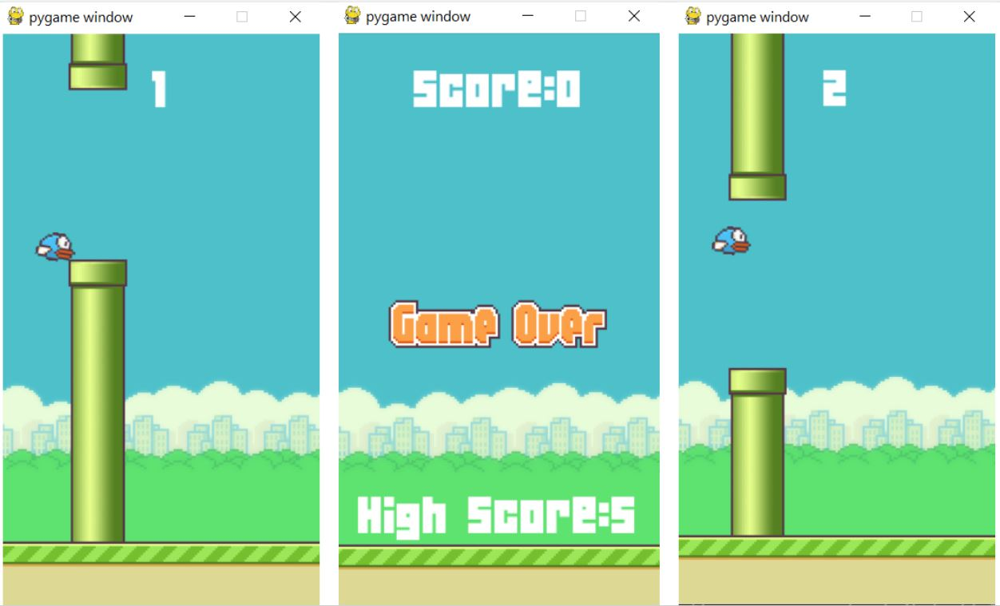

# Python Game Development Project
Welcome to flappy-bird!
- Description: A clone of the popular Flappy Bird game using Python
- Language: Python, PYGAME 
- DB: Game Score is store on Local storage.
- Tags: Game development, Python

Instructions to Run
```bash
# Open cmd prompt and go to file directory
cd [file location]
# Activating the Virtual Environment
myenv\scripts\activate
# To start the game
python flappy.py
````

**Note:**

Project is made according to my favorite play style. If you want to make your own custom game and initialize it to your custom play style. 

Checkout the steps below.



Python is a very versatile modern programming language and in this course you will learn basic game development using a python library called pygame.  We will be creating a clone version of the very popular game called flappy bird that made a lot of money for  it's developer few years ago.

Creating a flappy bird clone teach you some very useful practical skills in game development that you can use to create your own games in future.

Follow these steps to build a Game Development project using Python and its ecosystem of libraries:

TODO (Intro):
1. Create game surfaces and main display screen
2. Create basic animation
3. Check for events and how to trigger a response
4. Add scoring to game
5. Import images  onto their own surfaces and embed them in rectangles
6. Position objects on game screen
7. Spawn objects that are triggered by a timer
8. Add sound effects to game
9. Position objects on screen using coordinates

-> For ex: in the above image: 
- image 1: Collision 
- image 2: Game Over
- image 3: Score

We use these surface in a loop to make interactive and amazing to play

Explain how you'll do it:
Use pygame to initialize a virtual environment to play game.
In the virtual environment we create display surface, create different events and trigger response.
Add game score, Detect collision, trigger game over.
Add sound effect to increase interactive with the game.

1. **Environment Setup**
    - Create a ***Python file***. 
    - ***Import*** *pygame*
    - ***Initialize*** *pygame*
    - Create ***display surface*** (*canvas*) to draw game images.
        - It includes Display size
        - and Frame per second at which the display will be updated for smooth function of game 
    - ***Game loop:*** *Contains game logic*
    - ***Quit game***

    ```mermaid
    graph TD
        Initialize Pygame --> Display Surface(canvas);
        Display Surface(canvas) --> Game Logic;
        Game Logic --> Quit Game;
    '''
2. **Building Flappy Bird Game**

    1. We add game resources first, which include game images, sound, font used for game.
        -  game images in assets folder, sound in sound folder, and fond is in main folder 04B_19.TTF 
    2.  Basic Setup
    3.  Framerate
    4.  Animations
    5.  Bird addition
    6.  Obstacles addition
    7.  Check collision
    8.  Game End condition and Game Start conditions
    9.  Rotating bird ( basically bird should face up when flying and face down when falling).
    10.  Adding Sound effects
    
    - **Note:** check the commits to understand each points.

Project can be completely customize to your favorite playing style. All u need to do it change timeframe to increase speed difficulties. or you can change the soundboard attach to your liking.

